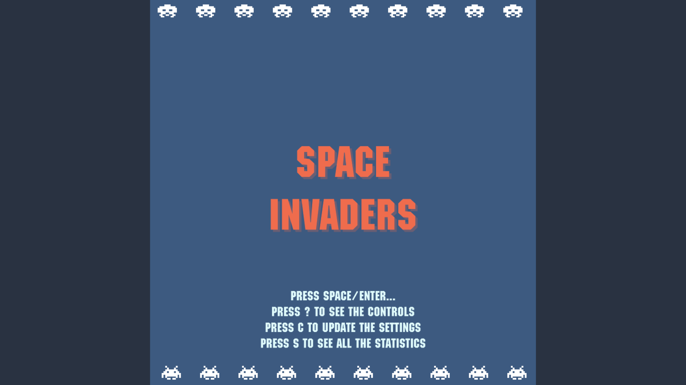
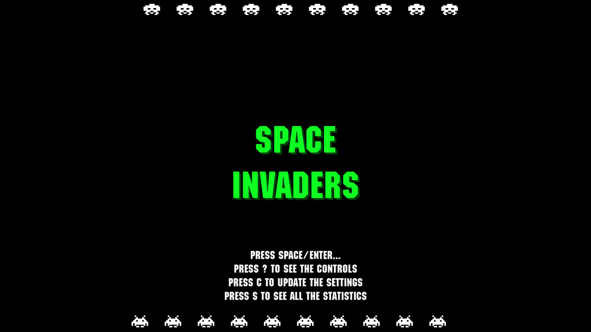
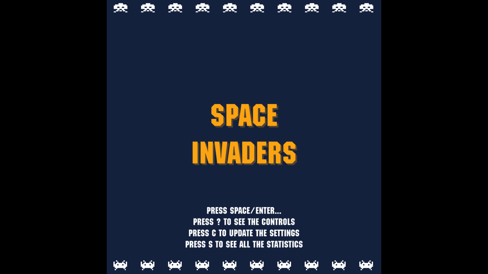
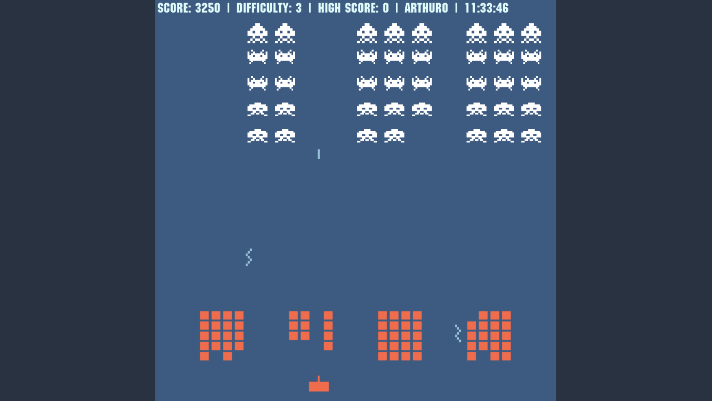

# SpaceInvaders

This project was created for my final exams in GO-AO informatics (6INFO).  
The task was to create a project which is a playable game in the .NET  
framework, which utilizes the MySQL.Data dll.

The project was finished on the 31'st of may 2021.

## Themes

There are three different themes, Default, Retro and Stylish.

## Gameplay preview

